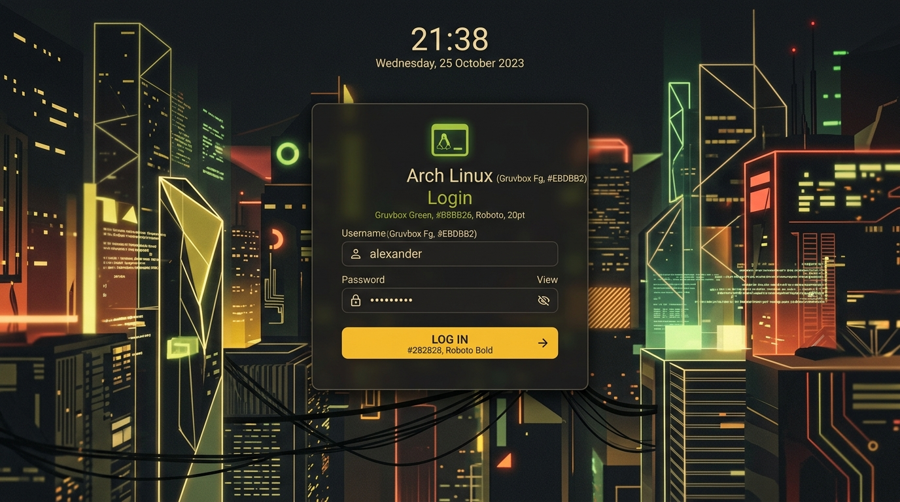

# Gruvbox Dark Cyber SDDM Theme



A custom SDDM theme featuring the classic Gruvbox dark aesthetic, paired with a collection of cyberpunk pixel art wallpapers. Built for Fedora KDE, but compatible with any distribution using SDDM.

## Installation

### Automatic Install
You can easily install this theme using the provided installation script:

```bash
chmod +x install.sh
sudo ./install.sh
```

### Manual Install
1. Copy the repository directory into your SDDM themes folder:
```bash
sudo cp -r . /usr/share/sddm/themes/gruvbox-dark-cyber-sddm
```
2. Set the theme in your SDDM configuration (`/etc/sddm.conf` or `/etc/sddm.conf.d/theme.conf`):
```ini
[Theme]
Current=gruvbox-dark-cyber-sddm
```

## Changing Wallpapers
This theme includes multiple cyberpunk pixel art wallpapers located in the `wallpapers/` directory.

To change the active wallpaper:
1. Open `theme.conf`
2. Change the `background=` line to point to your desired image in the `wallpapers/` directory.
   Example: `background=wallpapers/cyber_alley_neon.jpg`
